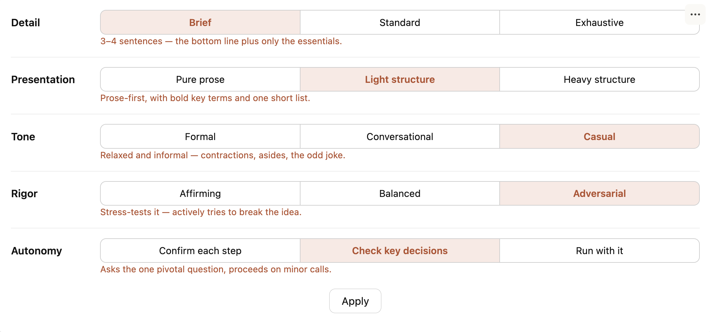

# Calibration Dials

A Claude Code plugin that lets you **tune Claude's interaction style** with simple,
named-stop dials — and have the setting **stick across every session**. Set how detailed,
structured, formal, critical, and hands-off Claude should be; the plugin saves the
matching instructions as a Claude Code [**output style**](https://code.claude.com/docs/en/output-styles)
so future sessions obey.

```
/calibrate
```



## Demo

<video src="https://github.com/dufis1/calibration-dials/raw/main/assets/calibrate-demo.mp4" controls muted width="100%"></video>

> If the player doesn't load inline (some markdown viewers don't render `<video>`),
> [watch the demo here](assets/calibrate-demo.mp4).

## The five dials

Each dial has three notches; leave any dial **unset** to keep Claude's default for that axis.

| Dial | What it controls | Notches |
|---|---|---|
| **Detail** | how much Claude says | Brief · Standard · Exhaustive |
| **Presentation** | prose vs. structure | Pure prose · Light structure · Heavy structure |
| **Tone** | the register / feel | Formal · Conversational · Casual |
| **Rigor** | how critically Claude engages your ideas | Affirming · Balanced · Adversarial |
| **Autonomy** | who holds the wheel | Confirm each step · Check key decisions · Run with it |

Pick the dials you care about, apply, and the settings persist as an output style. Re-run
`/calibrate` anytime to adjust; clearing a dial returns that axis to Claude's default.
Because an output style is part of the system prompt, a change takes effect after `/clear`
or in your next session.

## Install

From inside Claude Code:

```
/plugin marketplace add dufis1/calibration-dials
/plugin install calibration-dials
```

Then run `/calibrate` in any project.

## Two surfaces — works in both

- **Claude Code desktop app** → an interactive **dial widget** (click the notches).
- **Terminal Claude Code** → a native **arrow-key picker** (select notches with arrow /
  number keys — no typing).

The plugin detects the surface automatically and uses the right one. Either way the
settings persist identically as the output style.

## Custom dials — `/calibrate-studio`

The five built-in dials are not a closed list. `/calibrate-studio` lets you **author your
own dials** and harden them with the same evaluation loop used to validate the built-ins —
on a lifecycle of **author → validate → promote**. Custom dials show up in `/calibrate`
automatically, tagged *custom* (and *unvalidated* until a passing eval promotes them).

```
/calibrate-studio
```

## Requirements

- **Python 3.8+** (standard library only — no `pip install`). The plugin invokes `python3`.
- `/calibrate-studio`'s evaluation loop additionally uses the `claude` CLI under your
  existing subscription auth (no API key or per-token cost).

## How it works

`/calibrate` saves your selection as a Claude Code **output style** named `Calibrated`
(`.claude/output-styles/calibrated.md`, or `~/.claude/` for global) and activates it via
the `outputStyle` setting. Output styles are the purpose-built channel for steering
Claude's role, tone, and output format — they modify the system prompt — whereas `CLAUDE.md`
is for project and codebase context. The style ships with `keep-coding-instructions: true`,
so it changes *how* Claude communicates while leaving its software-engineering behavior
intact, and the directives injected per notch are validated steering instructions, not just
labels. Clearing every dial removes the style and deactivates it, without touching any other
output style or setting you've configured.
